<h1>Traffic Signs Dataset in YOLO format</h1>
<h3>Dataset Used:</h3>
https://www.kaggle.com/valentynsichkar/traffic-signs-dataset-in-yolo-format
<h3>YOLOv5:</h3>
https://github.com/ultralytics/yolov5

<h2>Results</h2>
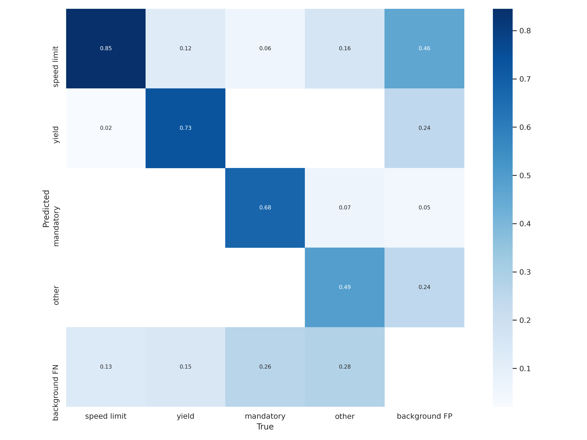
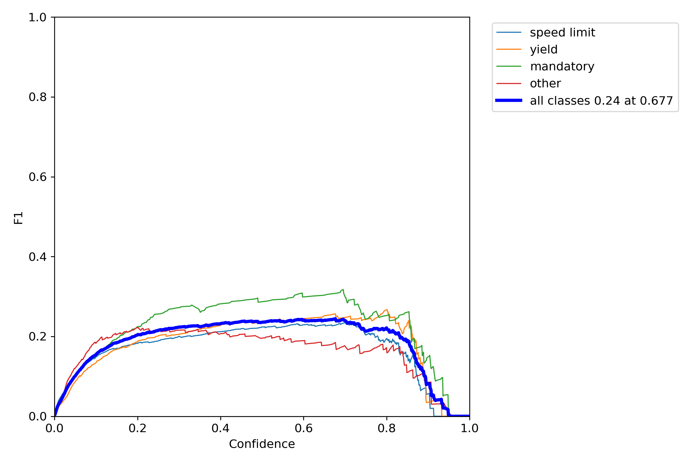
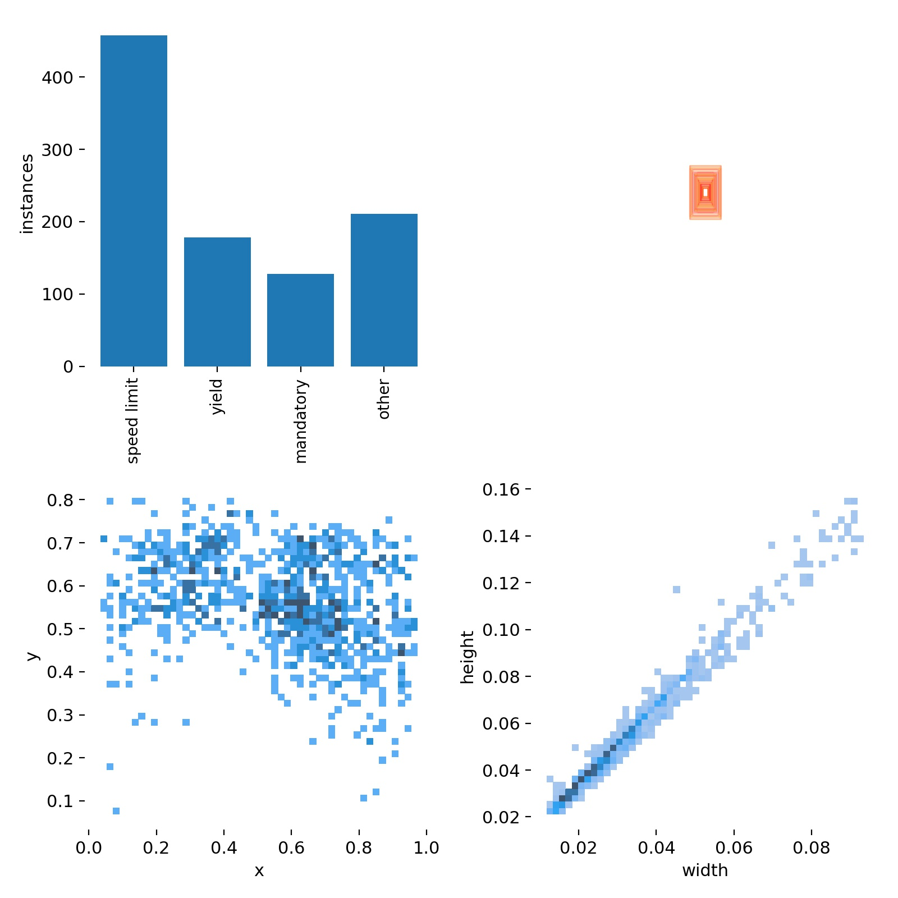
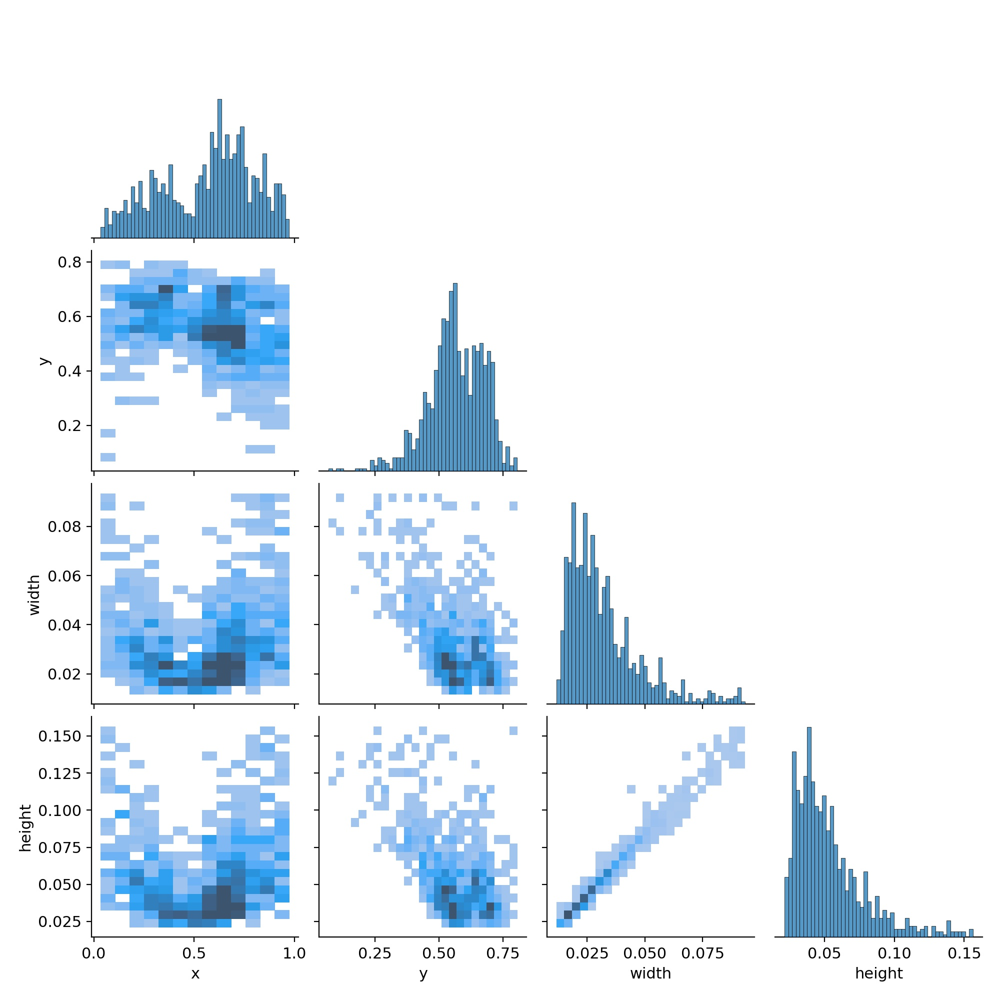
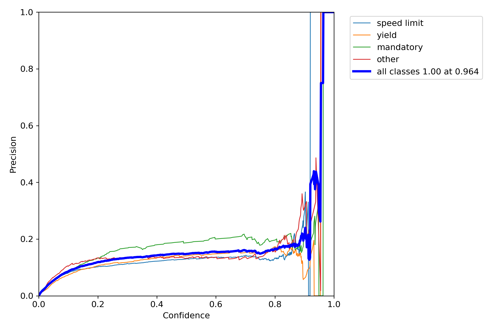
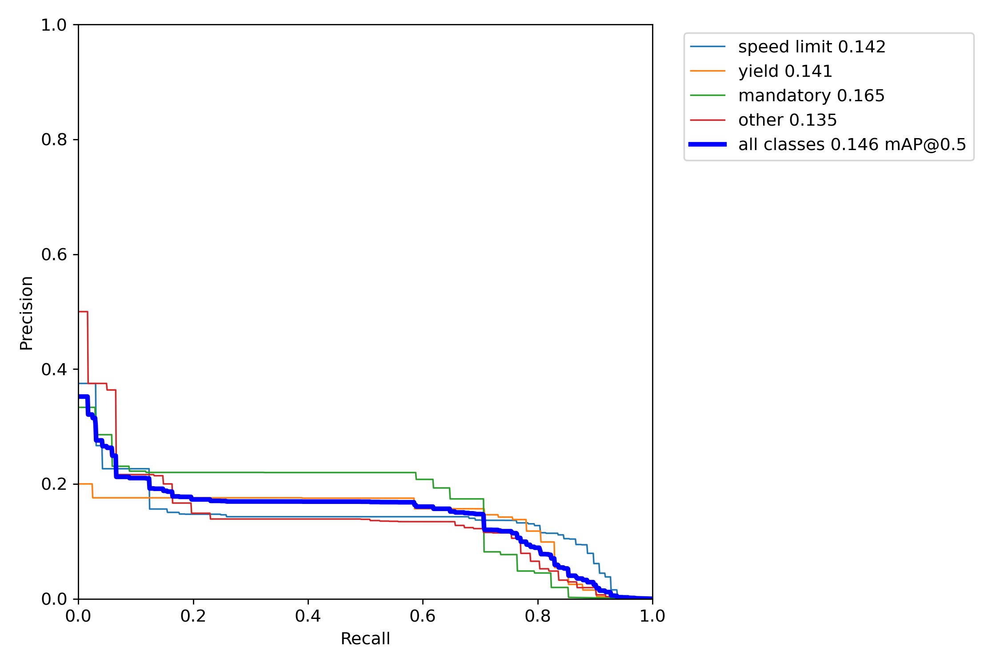
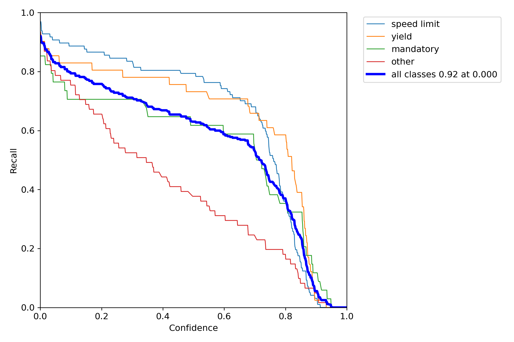
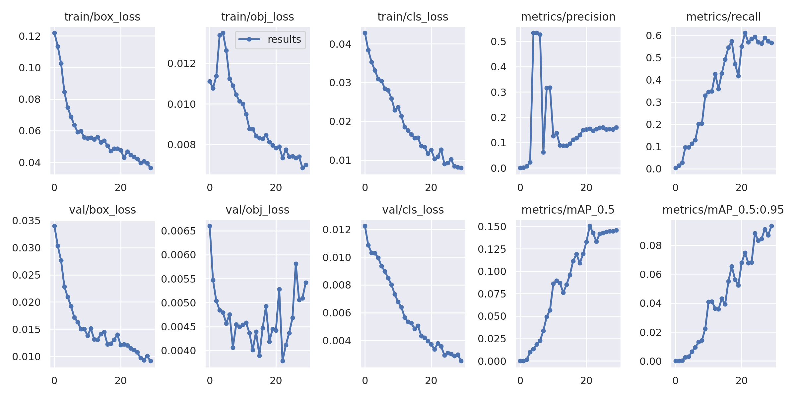
<h2>Train batch0</h2>
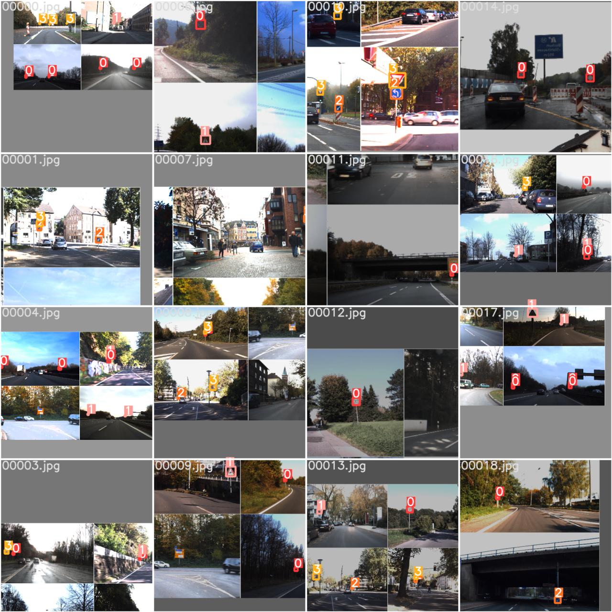
<h2>Train batch1</h2>
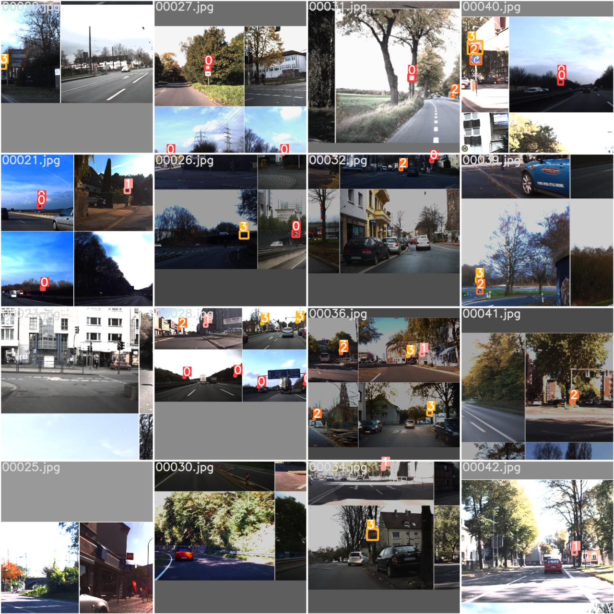
<h2>Val batch2</h2>
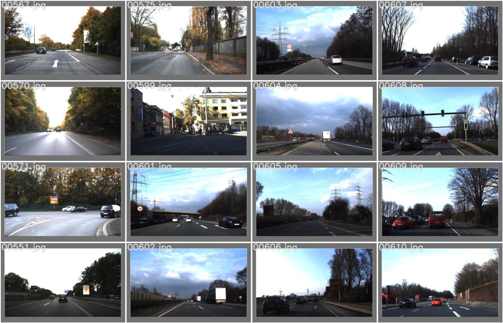
<h2>Val batch2 pred</h2>
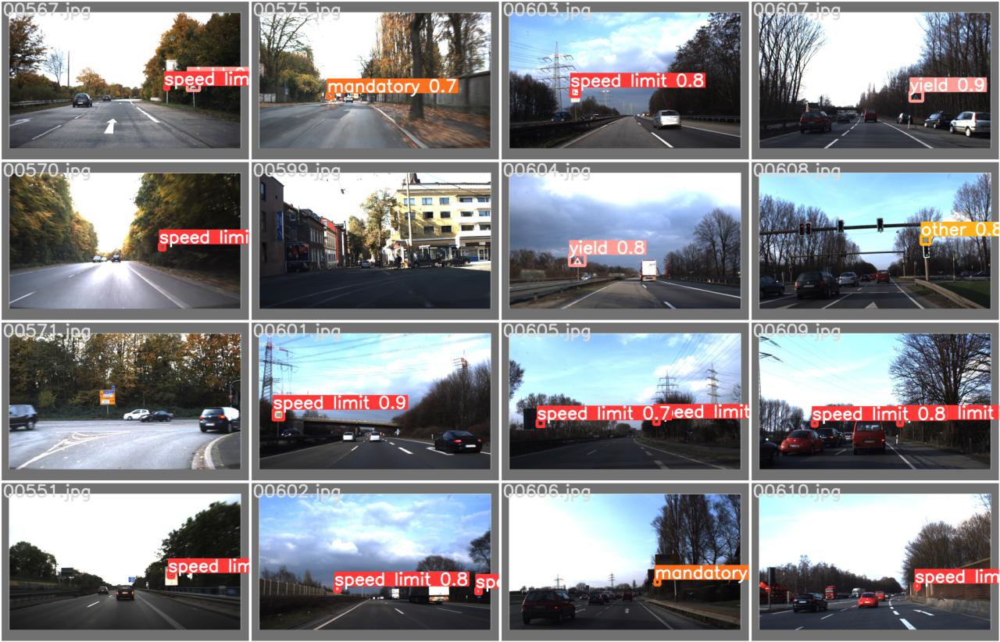
<h2>Detect</h2>
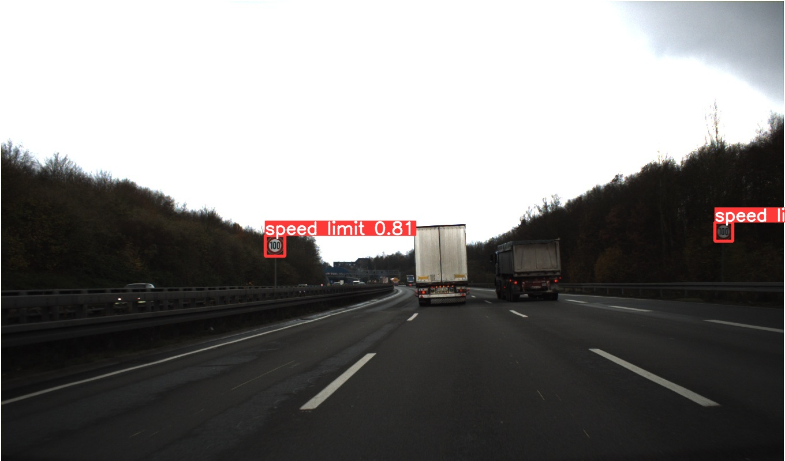
